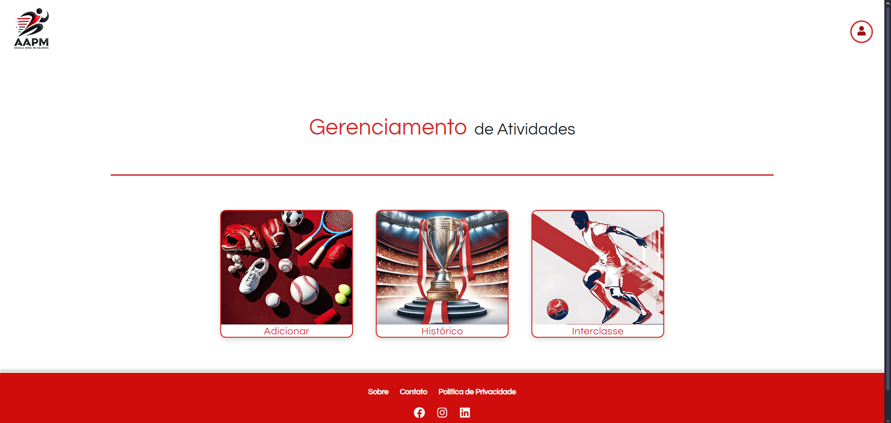
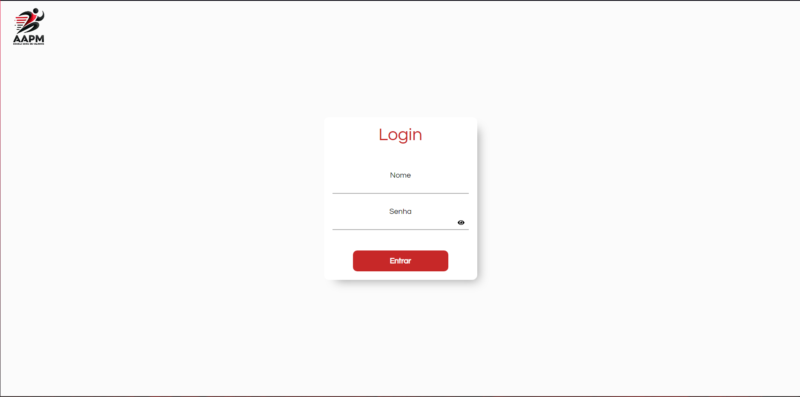
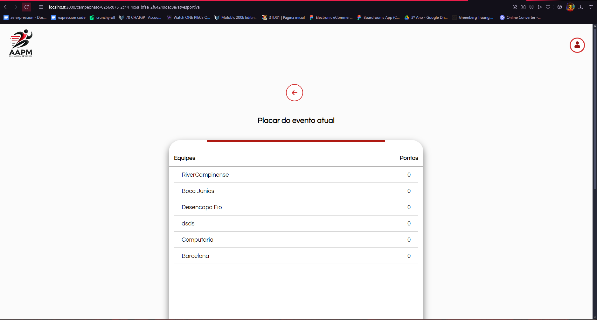
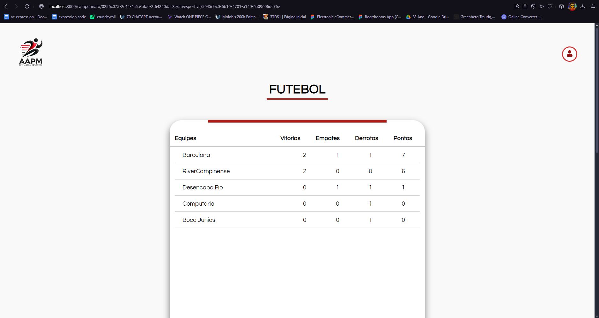
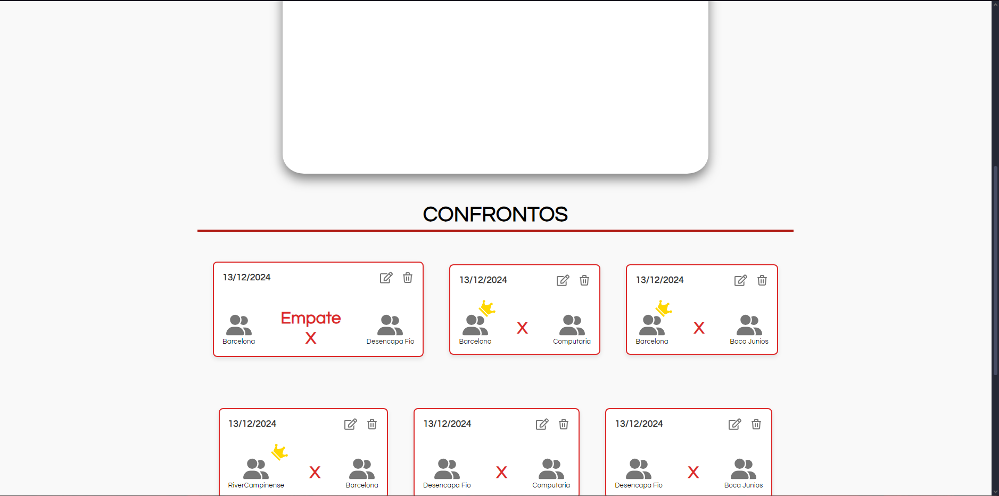

# Gestão Esportiva - Frontend

Este é o frontend do projeto de Gestão Esportiva, desenvolvido com Next.js e React. O objetivo deste projeto é gerenciar campeonatos esportivos, incluindo a criação de confrontos, gerenciamento de equipes e feedback dos usuários.

## Funcionalidades

- **Gerenciamento de Campeonatos**: Criação e edição de campeonatos esportivos.
- **Listagem de Times**: Visualização e gerenciamento de times participantes.
- **Confrontos**: Criação, edição e visualização de confrontos entre times.
- **Feedback dos Usuários**: Coleta de feedback dos usuários sobre os campeonatos.
- **Autenticação**: Sistema de login e registro para usuários.

## Tecnologias Utilizadas

- **Next.js**: Framework React para renderização do lado do servidor e geração de sites estáticos.
- **React**: Biblioteca JavaScript para construção de interfaces de usuário.
- **CSS Modules**: Estilização dos componentes de forma modular e isolada.
- **React Icons**: Biblioteca de ícones para React.
- **Axios**: Cliente HTTP para realizar requisições à API backend.

## Requisitos

- Node.js (versão 14 ou superior)
- npm ou yarn

## Instalação

1. Clone o repositório:

```bash
git clone https://github.com/seu-usuario/gestao-esportiva-frontend.git
```

2. Navegue até o diretório do projeto:

```bash
cd gestao-esportiva-frontend
```

3. Instale as dependências:

```bash
npm install
# ou
yarn install
```

4. Inicie o servidor de desenvolvimento:

```bash
npm run dev
# ou
yarn dev
```

O projeto estará disponível em `http://localhost:3000`.

## Estrutura de Imagens Demonstrativas

### Página de Campeonatos


### Página de Login


### Página de Modalidades


### Página de Modalidade - Placar


### Página de Modalidade - Confrontos


